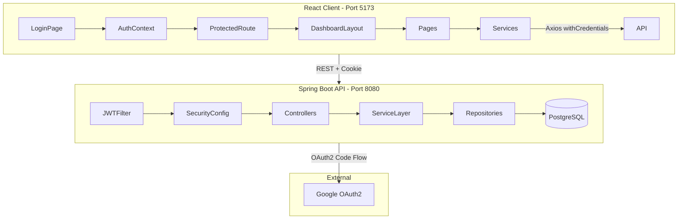
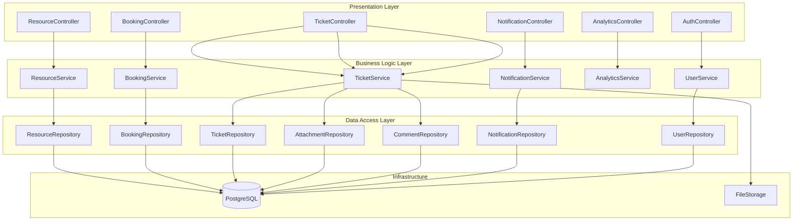
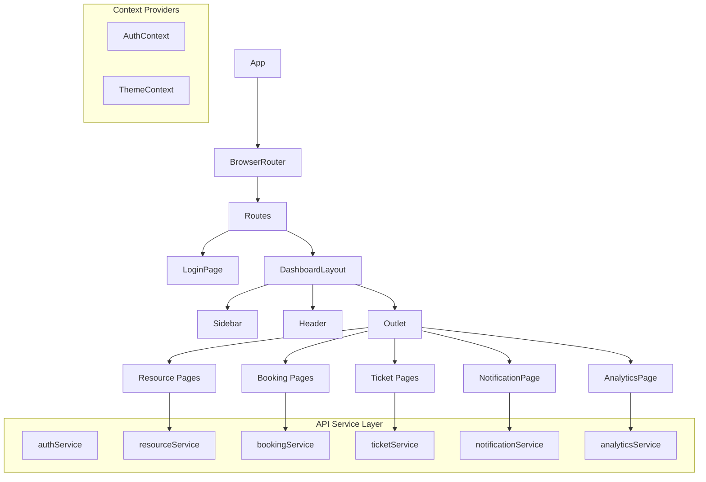
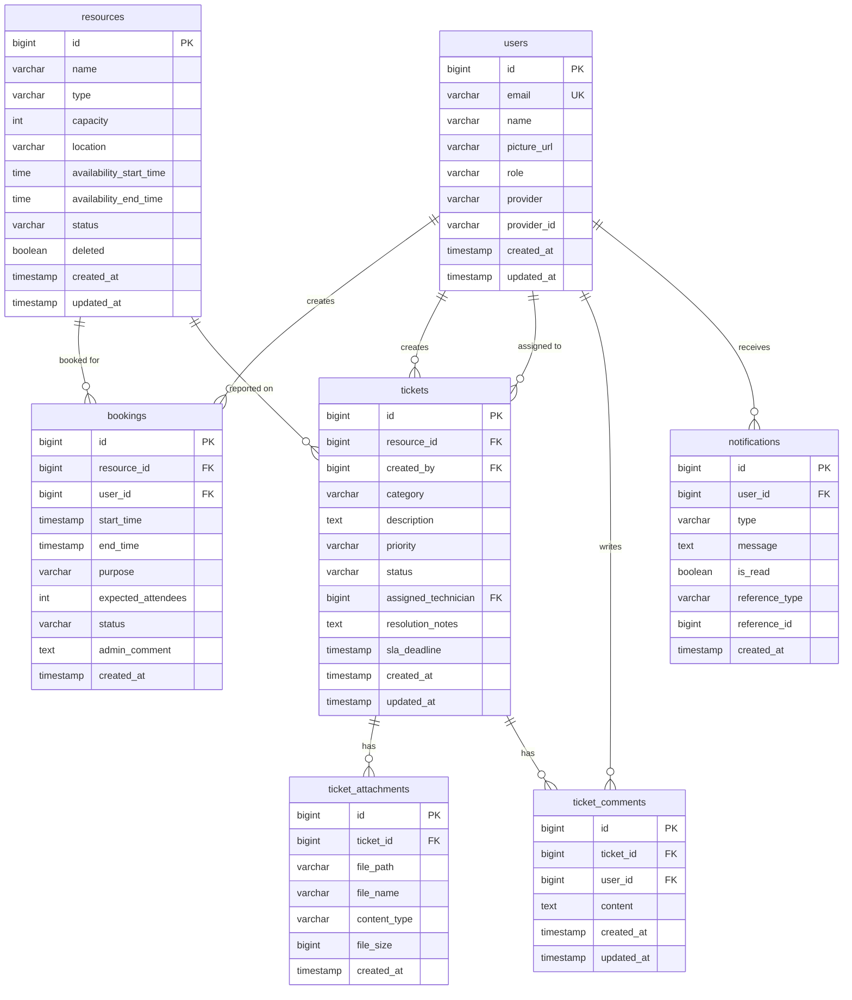

# Smart Campus Operations Hub — Final Report

## 1. Introduction

The Smart Campus Operations Hub is a full-stack web application designed to streamline campus facility management operations. It provides a centralized platform for browsing and managing campus resources, booking facilities, reporting maintenance issues, and receiving real-time notifications — all secured behind OAuth 2.0 authentication with role-based access control.

**Course:** IT3030 – Programming Applications and Frameworks  
**Stack:** Spring Boot 3.2 (Java 17) + React 18 (Vite + Tailwind CSS) + PostgreSQL  
**Authentication:** OAuth 2.0 (Google Login) + JWT

---

## 2. Business Scenario

A university campus has multiple facilities (lecture halls, labs, meeting rooms, equipment) that need to be managed efficiently. Faculty, staff, and students need to:

- **Browse** available campus resources and their schedules
- **Book** rooms and equipment for lectures, meetings, and events
- **Report** maintenance issues with attached evidence
- **Track** ticket resolution progress with comments
- **Receive** notifications about booking decisions and ticket updates

Administrators need a dashboard to oversee operations, approve/reject bookings, assign technicians to tickets, and analyze usage patterns.

---

## 3. Functional Requirements

### 3.1 API (Backend) Requirements

| ID | Requirement | Module |
|----|------------|--------|
| FR-01 | CRUD operations for campus resources | Resources |
| FR-02 | Search, filter, and paginate resources | Resources |
| FR-03 | Soft-delete resources | Resources |
| FR-04 | Create bookings with time conflict detection | Bookings |
| FR-05 | Approve/reject/cancel booking workflow | Bookings |
| FR-06 | Role-based booking visibility | Bookings |
| FR-07 | Create maintenance/incident tickets | Tickets |
| FR-08 | Ticket status workflow transitions | Tickets |
| FR-09 | File attachment upload (max 3 images, 5MB) | Tickets |
| FR-10 | Ticket comments with owner-only editing | Tickets |
| FR-11 | Assign technicians to tickets | Tickets |
| FR-12 | Notification triggers on status changes | Notifications |
| FR-13 | Mark notifications as read | Notifications |
| FR-14 | OAuth 2.0 Google authentication | Auth |
| FR-15 | JWT-based stateless session management | Auth |
| FR-16 | Role-based access control (USER, ADMIN, TECHNICIAN) | Auth |
| FR-17 | Analytics dashboard with aggregated data | Analytics |

### 3.2 Client (Frontend) Requirements

| ID | Requirement | Module |
|----|------------|--------|
| CR-01 | Google OAuth login page | Auth |
| CR-02 | Role-based sidebar navigation | Layout |
| CR-03 | Resource browsing with search and filters | Resources |
| CR-04 | Booking creation with datetime picker | Bookings |
| CR-05 | Admin booking approval dashboard | Bookings |
| CR-06 | Ticket submission with file upload | Tickets |
| CR-07 | Ticket detail view with comments | Tickets |
| CR-08 | Notification bell with unread count | Notifications |
| CR-09 | Analytics charts (bar, line, pie) | Analytics |
| CR-10 | QR code booking verification | Innovation |
| CR-11 | Dark/light theme toggle | Innovation |

---

## 4. Non-functional Requirements

### Security
- OAuth 2.0 with Google provider for authentication
- JWT tokens stored in HTTP-only cookies
- `@PreAuthorize` annotations for role-based endpoint protection
- CORS configuration restricted to frontend origin
- Input validation on all request DTOs
- File type and size validation for uploads

### Scalability
- Stateless REST API enables horizontal scaling
- Database connection pooling via HikariCP
- Cacheable responses for read-heavy endpoints

### Performance
- Spring Cache on resource listings and analytics
- Database indexes on frequently queried columns
- Paginated responses for all list endpoints
- Lazy-loaded JPA relationships

### Usability
- Responsive design (mobile + desktop)
- Loading indicators and skeleton states
- Toast notifications for user feedback
- Confirmation modals for destructive actions
- Empty state components

---

## 5. System Architecture Diagram



---

## 6. REST API Architecture Diagram



---

## 7. React Architecture Diagram



---

## 8. Database ER Diagram



---

## 9. Endpoint List

### Auth Endpoints
| Method | Endpoint | Status Codes | Access |
|--------|----------|-------------|--------|
| GET | `/oauth2/authorization/google` | 302 | Public |
| GET | `/api/auth/me` | 200, 401 | Authenticated |
| POST | `/api/auth/logout` | 200 | Authenticated |

### Resource Endpoints
| Method | Endpoint | Status Codes | Access |
|--------|----------|-------------|--------|
| GET | `/api/resources` | 200 | Public |
| GET | `/api/resources/{id}` | 200, 404 | Public |
| GET | `/api/resources/search?type=&status=&q=` | 200 | Public |
| POST | `/api/resources` | 201, 400 | ADMIN |
| PUT | `/api/resources/{id}` | 200, 400, 404 | ADMIN |
| DELETE | `/api/resources/{id}` | 204, 404 | ADMIN |

### Booking Endpoints
| Method | Endpoint | Status Codes | Access |
|--------|----------|-------------|--------|
| GET | `/api/bookings` | 200 | ADMIN |
| GET | `/api/bookings/my` | 200 | Authenticated |
| GET | `/api/bookings/{id}` | 200, 404 | Owner/ADMIN |
| POST | `/api/bookings` | 201, 400, 409 | Authenticated |
| PATCH | `/api/bookings/{id}/approve` | 200, 404 | ADMIN |
| PATCH | `/api/bookings/{id}/reject` | 200, 404 | ADMIN |
| PATCH | `/api/bookings/{id}/cancel` | 200, 404 | Owner |

### Ticket Endpoints
| Method | Endpoint | Status Codes | Access |
|--------|----------|-------------|--------|
| GET | `/api/tickets` | 200 | Role-based |
| GET | `/api/tickets/{id}` | 200, 404 | Authenticated |
| POST | `/api/tickets` | 201, 400 | Authenticated |
| PUT | `/api/tickets/{id}` | 200, 400, 404 | Owner/ADMIN |
| PATCH | `/api/tickets/{id}/status` | 200, 404 | ADMIN/TECHNICIAN |
| PATCH | `/api/tickets/{id}/assign` | 200, 404 | ADMIN |
| POST | `/api/tickets/{id}/attachments` | 201, 400 | Owner |
| GET | `/api/tickets/{id}/attachments/{aId}` | 200, 404 | Authenticated |
| GET | `/api/tickets/{id}/comments` | 200 | Authenticated |
| POST | `/api/tickets/{id}/comments` | 201, 400 | Authenticated |
| PUT | `/api/tickets/{id}/comments/{cId}` | 200, 403 | Owner |
| DELETE | `/api/tickets/{id}/comments/{cId}` | 204, 403 | Owner |

### Notification Endpoints
| Method | Endpoint | Status Codes | Access |
|--------|----------|-------------|--------|
| GET | `/api/notifications` | 200 | Own |
| GET | `/api/notifications/unread-count` | 200 | Own |
| PATCH | `/api/notifications/{id}/read` | 200 | Own |
| PATCH | `/api/notifications/read-all` | 200 | Own |

### Analytics Endpoints
| Method | Endpoint | Status Codes | Access |
|--------|----------|-------------|--------|
| GET | `/api/analytics/dashboard` | 200 | ADMIN |
| GET | `/api/analytics/bookings/peak-hours` | 200 | ADMIN |
| GET | `/api/analytics/resources/most-booked` | 200 | ADMIN |
| GET | `/api/analytics/tickets/resolution-time` | 200 | ADMIN |

---

## 10. Security Design

### Authentication Flow
1. User clicks "Sign in with Google" on the login page
2. Browser redirects to `/oauth2/authorization/google`
3. Spring Security redirects to Google's consent screen
4. Google returns authorization code to callback URL
5. Spring exchanges code for user profile
6. `OAuth2SuccessHandler` creates/updates the User entity
7. JWT is generated and set as an HTTP-only cookie
8. User is redirected to the React dashboard

### Authorization
- JWT filter validates the cookie on every request
- `SecurityContextHolder` is populated with user details and authorities
- `@PreAuthorize` annotations on controller methods enforce role checks
- Frontend `ProtectedRoute` component prevents unauthorized page access

### Security Measures
- HTTP-only cookies prevent XSS access to tokens
- CORS restricted to the frontend origin only
- Input validation via `@Valid` annotations and Jakarta Bean Validation
- File upload validation: type whitelist (JPEG, PNG, GIF), max 5MB size
- Global exception handler prevents stack trace leakage
- Environment variables for all secrets (JWT key, OAuth credentials)

---

## 11. Testing Strategy

### Unit Tests (JUnit 5 + Mockito)
- `CampusResourceServiceTest` — 7 tests covering CRUD, soft delete, search
- `BookingServiceTest` — 9 tests covering creation, conflict detection, state transitions, access control
- `TicketServiceTest` — 9 tests covering creation, status transitions, assignment, comments, access control
- `NotificationServiceTest` — 7 tests covering send, read, mark all, access control
- `UserServiceTest` — 5 tests covering find/create, role mapping

### Integration Tests
- Controller-level tests using `@SpringBootTest` + `@AutoConfigureMockMvc`
- H2 in-memory database for test isolation
- Spring Security test utilities for role simulation

### Coverage
- Target: 70%+ line coverage
- JaCoCo plugin configured for coverage reporting
- Reports generated at `backend/target/site/jacoco/`

### Running Tests
```bash
cd backend
mvn test
# View JaCoCo report: target/site/jacoco/index.html
```

---

## 12. CI/CD Strategy

### GitHub Actions Pipeline (`.github/workflows/ci.yml`)

**Triggers:** Push to `main`/`develop`, Pull Requests

**Backend Job:**
1. Checkout code
2. Setup Java 17 (Temurin)
3. Run `mvn test` with test profile
4. Build package with `mvn package -DskipTests`
5. Upload test reports and JaCoCo coverage as artifacts

**Frontend Job:**
1. Checkout code
2. Setup Node.js 20
3. Run `npm ci` (clean install)
4. Run `npm run build` (production build)
5. Upload build artifact

Both jobs fail the pipeline on any error.

---

## 13. Innovation Features

### 1. Admin Analytics Dashboard
Interactive dashboard with real-time charts powered by Recharts:
- **Most Booked Resources** — Bar chart showing the top 10 resources by booking count
- **Peak Booking Hours** — Line chart showing booking distribution across hours
- **Tickets by Status** — Pie chart showing ticket status distribution
- **Resolution Metrics** — Average ticket resolution time display

### 2. QR Code Booking Verification
- Approved bookings display a unique QR code containing booking details and a verification hash
- QR codes can be scanned at venue entrances for quick verification
- Implemented using the `qrcode.react` library

### 3. Dark/Light Theme Toggle
- Persistent theme preference stored in `localStorage`
- Applied via Tailwind CSS `dark:` variant classes
- Toggle accessible from the header toolbar
- All components support both light and dark modes

### Bonus: SLA Timer for Tickets
- Tickets automatically receive an SLA deadline based on priority:
  - HIGH: 4 hours
  - MEDIUM: 24 hours
  - LOW: 72 hours
- SLA deadline is displayed on the ticket detail page

---

## 14. Individual Contribution Mapping

| Member | Module | Backend Package | Frontend Pages | Key Responsibilities |
|--------|--------|----------------|----------------|---------------------|
| Member 1 | Resources | `com.smartcampus.resource` | `pages/resources/` | CRUD, search, pagination, caching |
| Member 2 | Bookings | `com.smartcampus.booking` | `pages/bookings/` | Conflict detection, workflow, QR codes |
| Member 3 | Tickets | `com.smartcampus.ticket` | `pages/tickets/` | Status workflow, attachments, comments |
| Member 4 | Auth + Notifications | `com.smartcampus.auth`, `com.smartcampus.notification` | `pages/notifications/`, `context/` | OAuth2, JWT, notifications, theme |

### Shared Responsibilities
- **Common infrastructure** (`com.smartcampus.common`, `com.smartcampus.config`) — shared across team
- **Analytics module** (`com.smartcampus.analytics`) — Member 1 + Member 2
- **CI/CD pipeline** — Member 4
- **Documentation** — All members

---

## 15. Screenshots

> **Note:** Screenshots to be captured from the running application.

### Login Page
`[Screenshot: Google OAuth login page]`

### Dashboard
`[Screenshot: Role-based dashboard with quick-access cards]`

### Resource List
`[Screenshot: Resource grid with search and filters]`

### Booking Creation
`[Screenshot: Booking form with datetime picker]`

### Admin Booking Management
`[Screenshot: Admin approval dashboard with status tabs]`

### QR Code Verification
`[Screenshot: QR code modal for approved booking]`

### Ticket Detail
`[Screenshot: Ticket view with comments and attachments]`

### Analytics Dashboard
`[Screenshot: Charts showing most booked resources and peak hours]`

### Notification Bell
`[Screenshot: Notification dropdown with unread badges]`

### Dark Mode
`[Screenshot: Application in dark theme]`

---

## 16. REST Architectural Constraints Compliance

| Constraint | Implementation |
|-----------|---------------|
| **Client-Server** | React frontend and Spring Boot API are completely separated. Communication is solely through REST endpoints. |
| **Stateless** | JWT tokens stored in cookies; no server-side session state. Each request is self-contained. |
| **Cacheable** | `@Cacheable` annotations on resource listings and analytics. `Cache-Control` headers. |
| **Uniform Interface** | Consistent URL patterns (`/api/{resource}`), standard HTTP methods, JSON responses, proper status codes. |
| **Layered System** | Controller → Service → Repository → Entity. DTOs separate API contracts from entities. |
| **Code on Demand** | Not used (optional constraint). |

---

*End of Report*
